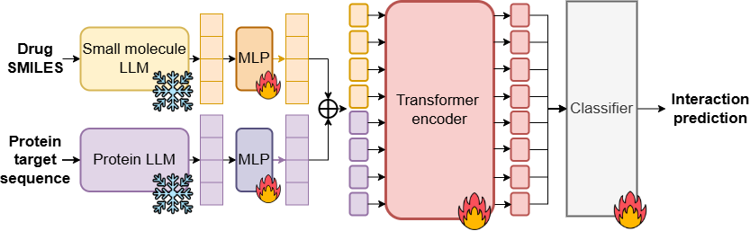

# LANTERN: Leveraging Large Language Models And Transformer For Enhanced Molecular Interaction



Contributors:
* Anonymous member 1
* Anonymous member 2
* Anonymous member 3

The main functionalities from LANTERN include, but not limited to:
- Featurization of ligand SMILES and protein Amino Acids.
- Training process and prediction scripts.
- A simple but effective methods that generalise across molecular interaction tasks (DTI, DDI, PPI, ...).

The main innovations we made away from LANTERN, but not limited to:
- Integration of pretrained LLM embeddings with Transformer-based interaction modeling.
- Broad applicability and SOTA performance.
- Efficiency and independence from 3D structural data.

## Setup Environment
Clone this repository and install dependencies:
```bash
git clone https://github.com/HySonLab/LANTERN.git
cd LANTERN
conda env create -f environment.yaml
conda activate LANTERN
```

### File structure 
Files should be placed as the following folder structure:
```
LANTERN
├── code
│   ├──file.py ...
├── data
│   ├── README.md
│   ├── embedding
├── log
│   ├── README.md
├── README.md
├── environment.yaml
│ 
```

## Training
### DTI datasets (BioSNAP, DAVIS, KIBA):

First, ensure that pretrained weights for all entities in the dataset are properly located at data\embedding\{dataset_name}.

Second, cd code .

Finally, run the training script:
```
python dti.py \
    --dataset_name "BioSNAP"\
    --embed_dim 384 \
    --seed 120 \
    --valid_step 10 \
    --epoch 100 \
    --lr 0.0001 \
    --dropout 0.1 \
    --modality 1 \
    --save_model True \
    --score_fun 'transformer' \
    --save_path path_to_saved_checkpoints \
    --drug_pretrained_dim 768 \
    --protein_sequence_dim 1024 \
   
```

Please modify the dataset_name, path_to_dataset, and save_path according to your experiments.

### DDI datasets (DeepDDI):

First, ensure that pretrained weights for all entities in the dataset are properly located at data\embedding\{dataset_name} .

Second, cd code .

Finally, run the training script:
```
python ddi.py \
    --dataset_name "DeepDDI" \
    --embed_dim 384 \
    --seed 120 \
    --valid_step 10 \
    --epoch 100 \
    --lr 0.0001 \
    --dropout 0.1 \
    --modality 1 \
    --save_model True \
    --score_fun 'transformer' \
    --save_path path_to_saved_checkpoints \
    --drug_pretrained_dim 768 \
   
```

### PPI datasets (yeast):

First, ensure that pretrained weights for all entities in the dataset are properly located at data\embedding\{dataset_name}.

Second, cd code.

Finally, run the training script:
```
python ppi.py \
    --dataset_name "yeast" \
    --embed_dim 384 \
    --seed 120 \
    --valid_step 10 \
    --epoch 100 \
    --lr 0.0001 \
    --dropout 0.1 \
    --modality 1 \
    --save_model True \
    --score_fun 'transformer' \
    --save_path path_to_saved_checkpoints \
    --protein_sequence_dim 1024 \
   
```

Please modify the dataset_name, path_to_dataset, and save_path according to your experiments.

## Evaluation 
First, cd code.
Second, run the following script :
```
python eval.py \
    --model_save_path path_to_checkpoint \
    --gpu True \
    --test_path path_to_dataset_folder \
```

## Predict interactions between a pair of entities
```
python predict.py \
    --model_save_path path_to_checkpoint \
    --gpu True \
    --type 'dti' \
    --sequence1 amino_acid_sequence_or_smiles_string \
    --sequence2 amino_acid_sequence_or_smiles_string \
```
## Acknowledgements

This work is primarily based on the following repositories:

- https://github.com/samsledje/ConPLex.git (BioSNAP, DAVIS - DTI datasets)
- https://github.com/thinng/GraphDTA.git (KIBA - DTI dataset)
- https://github.com/biomed-AI/MUSE.git (DeepDDI - DDI datasets)
- https://github.com/xzenglab/TAGPPI.git (Yeast - PPI dataset)


## Please cite our work as follows

```bibtex
```
